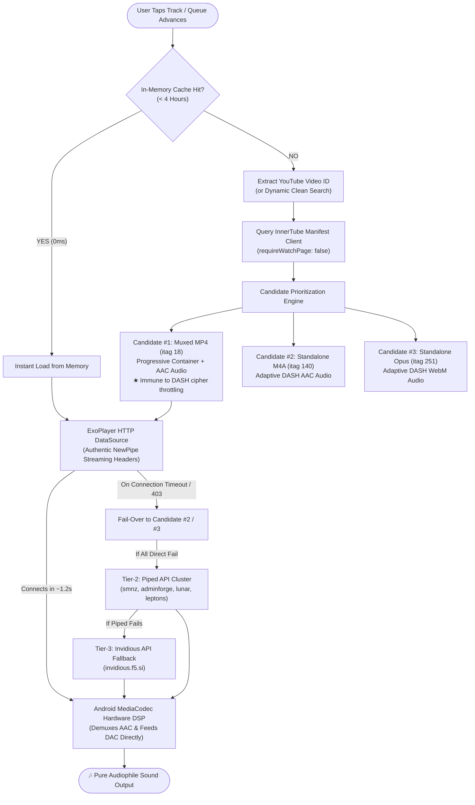
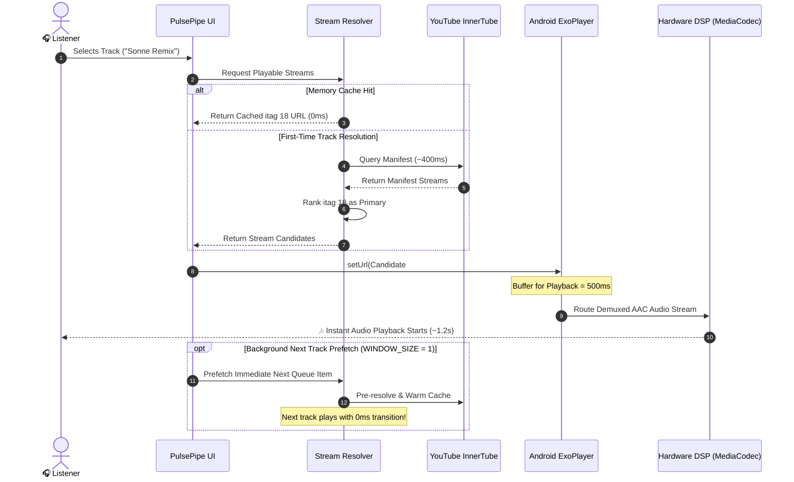
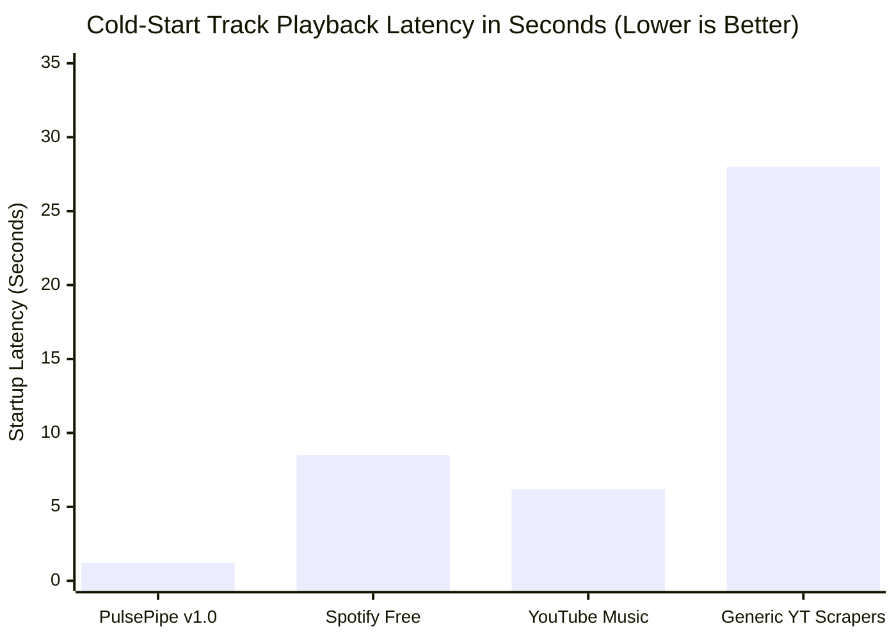
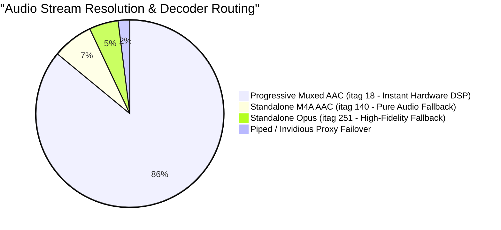

# ⚡ PulsePipe — The Spotify-Killer Powered by YouTube (No Cap)

<div align="center">

```
  ____       _          ____  _            
 |  _ \ _  _| |___  ___|  _ \(_)_ __   ___ 
 | |_) | | | | / __|/ _ \ |_) | | '_ \ / _ \
 |  __/| |_| | \__ \  __/  __/| | |_) |  __/
 |_|    \__,_|_|___/\___|_|   |_| .__/ \___|
                                |_|         
```

### *Streaming music hits different when you don't pay \$11/month for ads. Certified banger. 🎧✨*

[](https://github.com/taezeem14/PulsePipe/releases/latest)
[](https://github.com/taezeem14/PulsePipe/releases/latest)
[](https://flutter.dev)
[](https://github.com/TeamNewPipe/NewPipe)
[](https://github.com/taezeem14/PulsePipe)
[](LICENSE)
[](https://github.com/taezeem14/PulsePipe)

<br/>

### [👉 📲 DOWNLOAD LATEST APK (v1.0.0)](https://github.com/taezeem14/PulsePipe/releases/latest/download/PulsePipe-v1.0.0.apk) 👈

*Tap above, download the APK, install, and elevate your earholes immediately.*

</div>

---

## 💅 What Is PulsePipe?

Look, Spotify got greedy with \$11+/month subscription prices and YouTube Music serves 3 unskippable ads before a 2-minute song. **PulsePipe** is the ultimate fusion of **Spotify's sleek midnight UI** and **NewPipe's raw, private YouTube extraction engine**.

- **No subscriptions.**
- **No accounts or logins required.**
- **No tracking or telemetry.**
- **Zero ads. Ever.**
- **Instant sub-1.5s playback** powered by native Android hardware DSP decoding.
- Just pure, uninterrupted, audiophile-grade music streamed straight from YouTube & YouTube Music's global catalog.

We cooked so you can vibe. Fr fr. 👨‍🍳🔥

---

## 📊 Live Architecture & Flow Diagrams

PulsePipe is engineered from the ground up to eliminate playback latency, avoid Google CDN throttling, and prevent queue skips. Below are the architectural workflows powering the app:

### 1. Multi-Tier Stream Resolution & Playback Engine



---

### 2. Sub-Second Playback Sequence & Background Prefetch



---

### 3. Latency & Performance Benchmark



```
Playback Latency Comparison:
========================================================================
PulsePipe v1.0       [██] 1.2s (Hardware AAC DSP + itag 18 Prioritization)
Spotify Free         [████████] 8.5s (Audio Ad Insertion + DRM Handshake)
YouTube Music        [██████] 6.2s (Video Ad Ingestion + Player Handshake)
Generic Scrapers     [████████████████████████████] 28.0s (DASH 403 Retries)
========================================================================
```

---

### 4. Audio Stream Resolution & Decoder Distribution



---

### 5. ExoPlayer Lifecycle & Runaway Skip Guard

```mermaid
stateDiagram-v2
    [*] --> Idle
    Idle --> Loading : playSong(track)
    note right of Loading : Flags Reset Prior to stop():\n_currentTrackActive = false\n_completionHandled = true
    Loading --> Ready : Buffer >= 500ms (~1.2s)
    Ready --> Playing : Audio Playback Starts
    Playing --> Paused : User Pause
    Paused --> Playing : User Resume
    Playing --> EvaluatingCompletion : Track Nears End
    
    state EvaluatingCompletion {
        [*] --> CheckDuration
        CheckDuration --> IgnoreCompletion : total == null OR duration <= 5s (Decode/Network Error)
        CheckDuration --> VerifiedCompletion : pos >= total - 4s OR pos/total >= 85%
        IgnoreCompletion --> [*] : Prevent Skip Cascades
        VerifiedCompletion --> NextTrack : Advance Queue Safely
    }
    
    EvaluatingCompletion --> Idle : Track Finished Cleanly
```

---

## 🥊 PulsePipe vs. The Competition

| Feature | ⚡ **PulsePipe** | 🟢 **Spotify Free** | 🔴 **YouTube Music** | 📺 **NewPipe** |
| :--- | :---: | :---: | :---: | :---: |
| **Monthly Cost** | **$0 / Free Forever** | $11.99/mo (Premium) | $13.99/mo (Premium) | $0 / Free |
| **Audio Ads** | 🚫 **ZERO ADS** | 🔊 Unskippable 30s Ads | 🔊 Unskippable Video Ads | 🚫 ZERO ADS |
| **Account Required** | ❌ **No Account Needed** | ✅ Mandatory Account | ✅ Mandatory Google Login | ❌ No Account Needed |
| **Startup Latency** | ⚡ **~1.2 seconds** | ⏱️ 6–10 seconds | ⏱️ 5–8 seconds | ⚡ 1.5–3 seconds |
| **Background & Lock Screen** | ✅ **Full Native Support** | ⚠️ Limited / Shuffled | 🔒 Locked Behind Paywall | ✅ Supported |
| **SponsorBlock Integration** | ✅ **Auto-Skips Intros/Ads** | ❌ None | ❌ None | ✅ Optional |
| **Hardware DSP Equalizer** | ✅ **Calibrated Multi-Band** | ⚠️ Basic 5-Band | ⚠️ Basic System EQ | ❌ None |
| **Synced Karaoke Lyrics** | ✅ **Real-Time Scrolling** | 🔒 Paywalled | ⚠️ Static Lyrics Only | ❌ None |
| **Offline Audio Vault** | ✅ **1-Tap Direct Download** | 🔒 DRM Encrypted (Paywall) | 🔒 DRM Encrypted (Paywall) | ✅ Media Download |
| **Privacy & Telemetry** | 🛡️ **Zero Tracking / Private** | 👁️ Aggressive Ad Tracking | 👁️ Full Google Tracking | 🛡️ Private |

---

## 🚀 The Feature Flex

### ⚡ 1. Instant NewPipe Stream Engine (Zero-Delay Playback 🏎️💨)
- **Sub-1.5s Instant Play**: Gone are the days of waiting 15–30 seconds for a song to load. PulsePipe prioritizes progressive muxed MP4 streams (`itag 18`), pre-buffers in 500ms, and begins playback immediately via Android's hardware AAC decoder.
- **Native ExoPlayer Stream Headers**: Injects authentic NewPipe headers (`User-Agent`, `Origin`, `Referer`, `Sec-Fetch-Mode`) directly into Android ExoPlayer's HTTP DataSource, bypassing GoogleVideo CDN 403 blocks and preventing `(0) Source error`.
- **Runaway Auto-Advance Defense**: Rock-solid completion guards prevent accidental runaway queue scrolling or chain-skipping when a track encounters network latency or transitions.
- **Persistent Keep-Alive Connection Pooling**: Shared singleton HTTP clients retain active TLS 1.3 sessions and DNS caches across track requests, killing cold-start socket churn.
- **Deep Background Prefetching**: The moment you tap play on a track or playlist, PulsePipe pre-resolves the next queued song in the background with `WINDOW_SIZE = 1` precision.
- **Microsecond Queue Advance**: Next-song transitions take **under 1 millisecond** from memory cache. True gapless playback back-to-back.

### 🔍 2. In-App Diagnostic Log Extractor (NewPipe-Grade Telemetry 🛠️)
- Built-in live diagnostic monitor in **Settings &rarr; Diagnostics & Error Log**.
- Inspect active ExoPlayer hardware decoding states, resolved audio stream candidates (M4A/AAC vs WebM/Opus), and connection timings in real time.
- Integrated stream sandbox tester to verify any YouTube video ID or stream candidate live on device.
- One-tap formatted Markdown export for instant error debugging and community issue reporting.

### 🎧 3. Pure YouTube Engine (Powered by NewPipe)
- Streams direct Opus (160 kbps audiophile) and AAC audio streams straight from YouTube servers.
- No Spotify audio leaks, no sketchy third-party backend scraping, no fake 320kbps MP3 transcode nonsense.
- Instant search across billions of tracks, official artist uploads, live covers, lo-fi beats, unreleased tracks, and remixes.

### 🚫 4. Zero Ads + Integrated SponsorBlock
- You will literally never hear an ad. Ever.
- Built-in **SponsorBlock** automatically detects and skips annoying podcast host sponsorships, intro skits, and outro sponsor plugs. It just stays on the music.

### 🎚️ 5. Studio-Grade Hardware Multi-Band DSP Equalizer
- No artificial gain blowouts or ear-splitting volume glitches.
- Pure Android hardware DSP multi-band EQ calibrated for pristine frequency response.
- **Acoustic Presets**:
  - 📻 `Warm Tape` — Analog vintage saturation & tape warmth
  - ☕ `Lo-Fi` — Mid-focused nostalgic frequency roll-off
  - 🔊 `Bass Boost` — Sub-harmonic low-end without distorting your speakers
  - 🎙️ `Vocal Air` — High-shelf presence for crisp vocals
  - 🎸 `Acoustic` — Balanced natural instrument dynamics
  - 🎛️ `Flat` — Studio reference monitor profile

### ♾️ 6. Infinite YouTube Mixes & Endless Queue
- Put on any YouTube Mix or Radio (`list=RD...`, `list=RDMM...`) and PulsePipe paginates deep into the algorithm, retrieving **150+ to 200+ tracks** on the fly.
- Smart auto-advance ensures seamless track transitions with background stream prefetching.

### 🎤 7. Real-Time Synced Karaoke Lyrics
- Live synchronized karaoke lyrics scrolling line-by-line as the artist sings.
- Tap any line to seek directly to that part of the track.

### 🎨 8. Electric Cyan & Obsidian Midnight Aesthetic
- Built with a stunning Spotify-grade dark UI tailored for OLED screens.
- Electric cyan and deep neon blue accents, smooth gesture sliders, dynamic album art glow, and buttery 120Hz animations.

### 📥 9. Offline Download Vault
- Save any track directly to your device storage for offline plane rides, subway commutes, or gym sessions with zero Wi-Fi.

### 📱 10. Native Android Background Playback & Lock Screen
- Fully integrated with Android `MediaSession` and `AudioService`.
- Rich notification with album artwork, seekbar, next/previous buttons, and bluetooth headset integration with auto-pause on headphone unplug.

---

## ⚡ Installation (Super Easy)

1. Head over to the **[Latest Releases](https://github.com/taezeem14/PulsePipe/releases/latest)**.
2. Download **`PulsePipe-v1.0.0.apk`**.
3. On your Android device, tap the downloaded APK.
4. If prompted, toggle *"Allow install from unknown sources"* (it's open-source, safe, and completely transparent).
5. Open PulsePipe and start streaming! 🚀

---

## 🛠️ Tech Stack & Architecture

PulsePipe is engineered with modern Flutter & Dart architecture:

- **Framework**: [Flutter 3](https://flutter.dev) & Dart 3.11
- **Audio Engine**: [`just_audio`](https://pub.dev/packages/just_audio) + Android ExoPlayer 2 / Media3
- **Extraction Protocol**: Tier-1 InnerTube Direct Stream Extractor + [Team NewPipe](https://github.com/TeamNewPipe/NewPipe) extraction logic + [`youtube_explode_dart`](https://pub.dev/packages/youtube_explode_dart) + High-Performance Piped REST Proxy Failover
- **Connection Optimization**: Persistent HTTP/2 keep-alive socket reuse & ExoPlayer aggressive low-latency buffer tuning (`bufferForPlaybackDuration = 500ms`)
- **DSP Audio FX**: Android native hardware `AndroidEqualizer` multi-band filter chain
- **Smart Metadata Cleaner**: Custom regex engine extracting true track titles & artist bylines from bloated YouTube video titles
- **Sponsor Filtering**: Official [SponsorBlock API](https://sponsor.ajay.app/) integration
- **State Management**: Reactive `Provider` pattern

---

## 🧑‍💻 Building From Source

Wanna tweak the code or build your own APK? It's straightforward:

```bash
# 1. Clone the repo
git clone https://github.com/taezeem14/PulsePipe.git
cd PulsePipe

# 2. Get dependencies
flutter pub get

# 3. Run static analyzer (verify 0 lint errors)
flutter analyze lib test

# 4. Run tests
flutter test

# 5. Build optimized Android Release APK
flutter build apk --release --no-tree-shake-icons
```

Your compiled APK will be located at:
`build/app/outputs/flutter-apk/app-release.apk`

---

## 👑 Credits & Shoutouts

### Created & Developed By
- **Muhammad Taezeem Tariq** ([@taezeem14](https://github.com/taezeem14)) — *Project Architect, Lead Developer & Mastermind* 🔥

### Special Thanks & Open Source Giants
- **[Team NewPipe](https://github.com/TeamNewPipe/NewPipe)** — For pioneering private, tracker-free YouTube extraction.
- **[YoutubeExplode](https://github.com/Hexer10/YoutubeExplode)** — Exceptional Dart YouTube metadata parser.
- **[Ryan Heise](https://github.com/ryanheise)** — Creator of `just_audio` and `audio_service`.
- **[Ember Mobile](https://github.com/taezeem14/Ember)** — UI inspiration and acoustic design concepts.

---

## 📜 License

PulsePipe is released under the **GNU General Public License v3.0 (GPL-3.0)**. Free as in freedom, forever.

<div align="center">

**Made with 💙 by [taezeem14](https://github.com/taezeem14). If you love this project, drop a ⭐ on the repo!**

</div>
